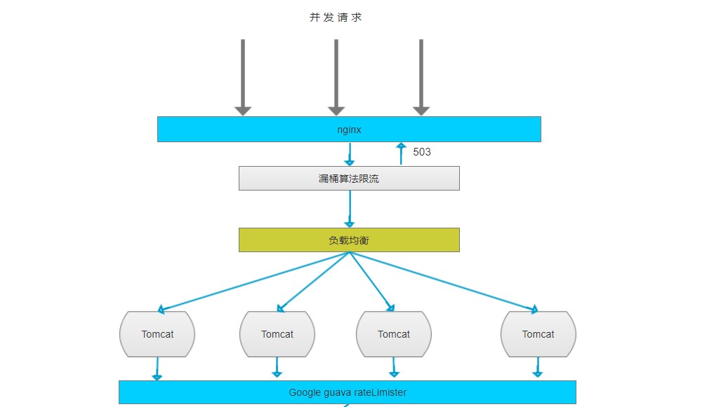
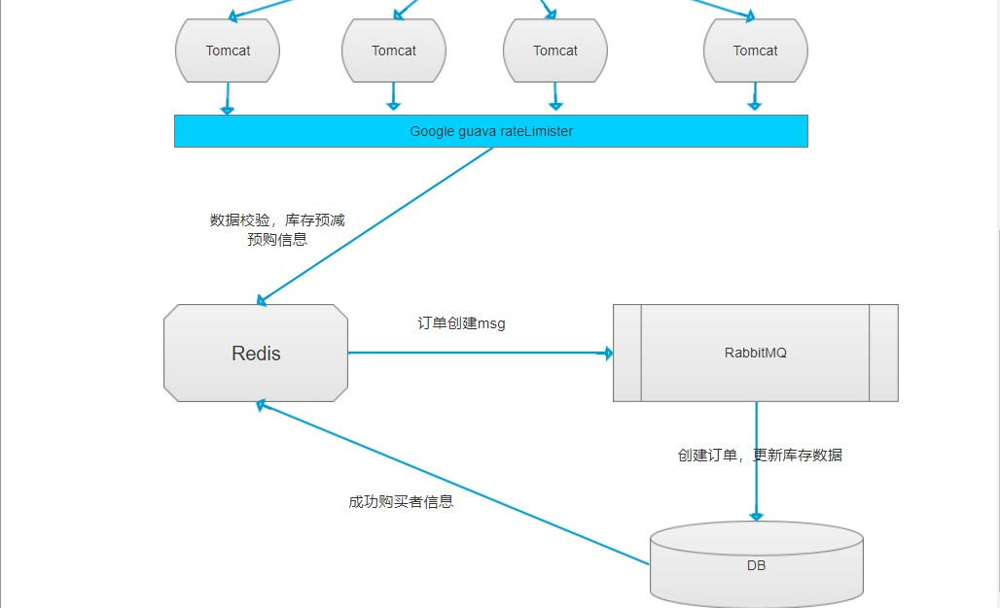

# **秒杀设计**

## 1、概要

秒杀模块，通过各种技术的支持，实现能够接受高并发有效的商品抢购系统

## 2、技术选型
  基于spring boot2.X版本，做后台框架搭建的基础支持。
  + 限流：nginx的漏桶算法 + goole guava rateLimister单位时间机会限流
  + 缓存：redis做秒杀的信息存储和与操作，例如热点商品、库存、用户
  + 消息：RabbitMQ做消息的异步传输，用户的秒杀动作和实际的库存变更、下单分开
  + 数据库：Mysql提供数据的存储，采用数据库的行锁 待优化（分布式锁）

## 3、设计架构图

## 4、过程逻辑分析
+ 1、先经过nginx限流（漏桶算法），控制一定流量能够访问服务器
+ 2、经过nginx负载均衡(轮询) 将请求分发到各个tomcat
+ 3、系统内部采用google guava rateLimister限流
+ 4、得到请求令牌的，进行数据验证
    + 数据是否更改过
    + 是否已经得到机会过
    + 是否在指定时间内
    + 库存是否足够
+ 5、排队机会获取写入redis，redis库存预减去 发送消息到MQ
    + 失败 编写失败回调操作，删除redis预购key，回增库存
+ 6、MQ异步获取消息
    + 成功
        + 创建订单
        + 删减库存
        + 写入秒杀成功用户信息到redis
        + ack确认
    + 失败
        + 重试
        + 第二次失败 抛弃该条数据
        + redis的库存是否回增加 按业务需求来
+ 7 定时任务 更新超时未支付订单状态
